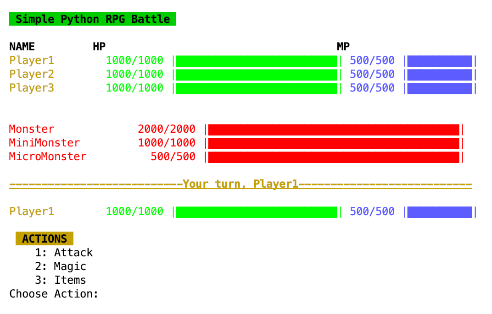

# RPG Battle Script
This is a simple RPG Battle using Python 3  :video_game:


> 


### Running the script
Use `main.py` to start the game.

```
python3 main.py
```

##### References
> Initial project from [Python course](https://jtdigital.teachable.com/) created by:<br/> 
Joseph Delgadillo [@JosephDelgadillo](https://github.com/JosephDelgadillo/) 
& Nick Germaine [@nickgermaine](https://github.com/nickgermaine/)
